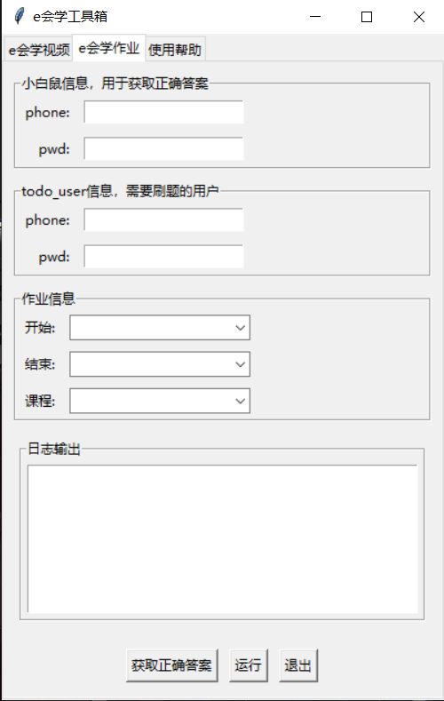
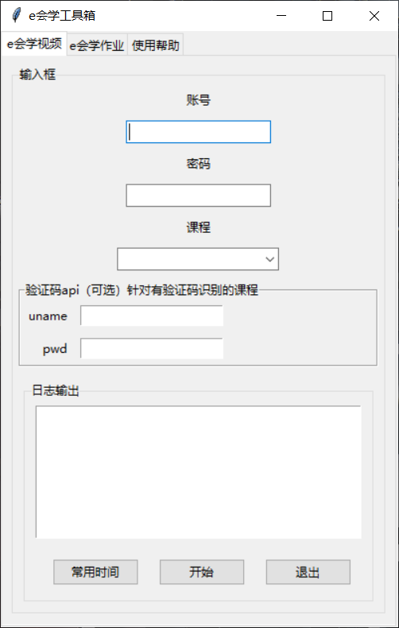

# e会学工具箱

## About

本项目是针对安徽省智慧教育平台"e会学"的的全自动化脚本，支持全自动播放视频，自动跳过随堂任务，支持部分作业题目自动作答，同时提供gui界面傻瓜式操作

## How to use

### 1.使用教程

**作业部分：**
- 通过解析已完成试题获得正确答案（请确保提交试卷后可以获取正确答案）
- 准备小号用于获取正确答案
- 指定课程和习题后开始运行脚本

**视频部分：**
- 确保已安装最新版Chrome或使用与Chrome版本对应的Chrome driver
- 获取课程后指定课程运行脚本
- 目前只支持检测随堂练习和随机验证码两种随堂任务
- 使用验证码api时，填入下方api网站的账号密码即可

> 浏览器驱动下载地址：https://chromedriver.chromium.org/downloads
> 
> 验证码识别api注册地址：http://www.ttshitu.com/

## 免责声明

该脚本是根据我个人的需求和经验编写的，仅供参考和学习之用。使用该脚本所带来的所有风险和责任均由使用者自行承担。作者不对该脚本的适用性、准确性、完整性、可靠性、可用性或其他任何方面做出任何明示或暗示的保证或担保。作者不对因使用该脚本而造成的任何直接、间接、偶然、特殊或后果性损失或损害承担任何责任。使用者应该在使用该脚本前自行评估其适用性和风险，并采取适当的预防措施。
