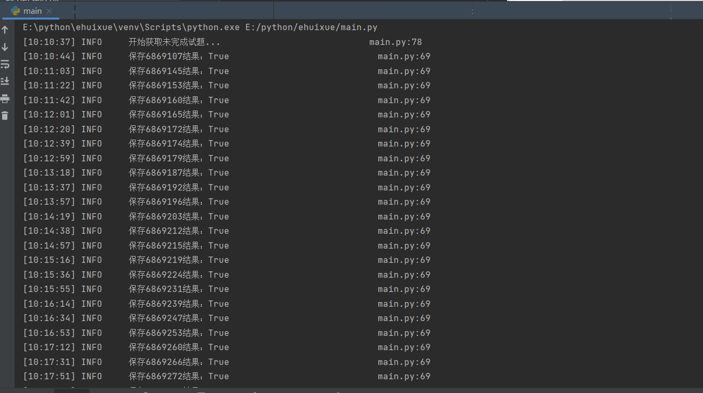

# e会学 小助手

## About

本项目是针对安徽省智慧教育平台"e会学"的随堂练习，作业，测验，视频的全自动化脚本，基于python3实现，上手使用需要一定基础

## How to use

### 1.使用前提

**练习题部分：**
- 作业提交后可以显示正确答案的题目
- 课程的试题非随机的，即每个账号的题目一样（不在乎正确率的话也可以用）
- 准备一个小号用于获取正确答案
- 配置好相关开发环境，python, mysql

**视频部分：**
- 视频脚本基于selenium，故需要提取安装好与你浏览器（暂时只支持谷歌）版本一致的驱动
- 如果视频有验证码检测的话还需要准备一个api账号，用于识别验证码

> 浏览器驱动下载地址：https://chromedriver.chromium.org/downloads
> 
> 验证码识别api注册地址：http://www.ttshitu.com/

### 2.运行脚本

- 克隆代码

  ```git clone https://github.com/kairui1108/EhuixueAutomatic.git```

- 安装依赖

  ``` pip3 install -r requirements.txt ```

- 建表
  > 建议使用pycharm配置好datasource后直接运行sql脚本

- 修改配置文件
  - database: 数据库相关配置
  - pioneer_cookie: 小白鼠账号ck
  - todo_user_cookie: 你的账号ck
  - start_eid: 每个课程的作业题和随堂练习题中的第一个习题的eid，通过抓包或网页源码获取
  - end_eid: 同上，是最后一个习题的eid
  
- 运行代码

进入相应目录，执行脚本
  
  ```shell
  python3 main.py
  or
  python3 app.py
  ```
  
  > 建议先根据main.py中的注释，选择性的打开注释或关闭注释
  
## 刷题运行效果




